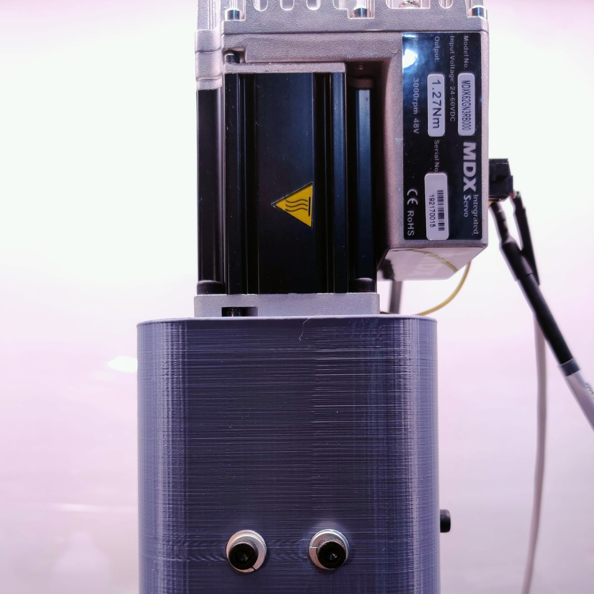

# Automatic Machining Parameter Detection
A CNC controller that learns material characteristics and optimizes its own feeds and speeds.

# Project Status
Finishing thesis writing.

## Current Goals
The goal of this project is to make a system that faces a material using an endmill while simultaneously performing regression on sensor data to complete its model. This model is used to optimize subsequent passes (feedrate and WOC) by means of an objective function that weighs MMR against the chance of failure (deflection, breakage, spindle overload).

## Modeling
Models for forces experienced during the cutting process and models for tool / machine failure are in [software/models.py](software/models.py).

The linear model converges well when given test data sweeps. 

## Optimization
The optimization systems are in [software/models.py](software/models.py)

The system successfully finds optimal cutting parameters for most materials.

[A video demonstrating convergence](assets/sweep_videos.mp4)

More convergence graphs can be found in [assets/ammp_graphs](assets/ammp_graphs/)

## Hardware
The hardware setup is finished. The machine is a Taig Micro Mill (kindly donated by Ted Hall).

The spindle motor is an MDX servomotor from Applied Motion products.

A 1D tool-force dynamometer was constructed using a Schneeberger frictionless slide and a disc-type preloaded load cell.

The machine electronics are enclosed for safety.

## Software
The machine controller is in the [software](software/) folder. [ammp.py](software/ammp.py) contains the optimization loop.